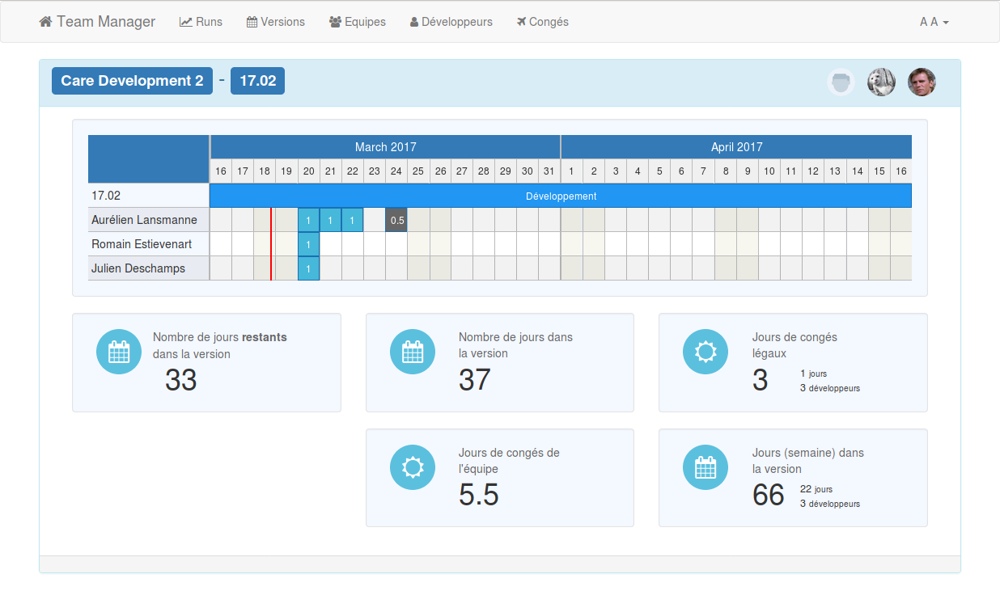

# Introduction
A basic team manager that can assign developers to teams, fetch holidays, and estimate how many working hours are available in a given version.
  
This application was built on top of "Base" (http://themeteorchef.com/base), and is **mainly aimed for my own company** (but you can use it as is, or build on top if it). Right now, it's only available in **french** !
Developers are linked to a JIRA account, but this is **not mandatory** and will only be used to fetch their avatar.





# Installation
Ton run this project, you'll need
* Node (and NPM) :  https://nodejs.org/en/download/
* Meteor : https://www.meteor.com/install
* GIT : https://git-scm.com/downloads
 
First, fetch this project with GIT
```
git clone https://github.com/KyneSilverhide/team-manager.git
 ```
Open the newly created folder and run
 ```
npm install
 ```
 
Open `settings.json` and change the values, if needed.
 
Finally, just run meteor with this command (this is an alias to use the `settings.json` file)
```
meteor npm start
```

# How to use
* Create an account (you can use any mail you want, there is no validation)
* Go to "Equipes", and add your company teams
* Go to "Developpeurs" and create developers. Link them to their proper team
* Go to "Versions" and add your releases
* Go to "Runs", create a new run, pick a team, a version, and add developers if needed, then adjust the development ratio
* Go back to the main page to see the dashboard

# Future features ?
[ ] Translation(s)
[ ] Optional JIRA relationship
[ ] Improved mobile support
